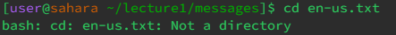
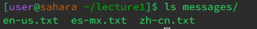
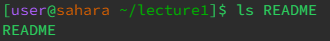
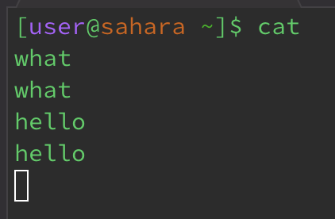
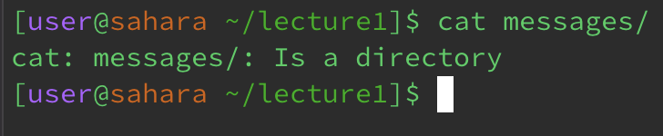
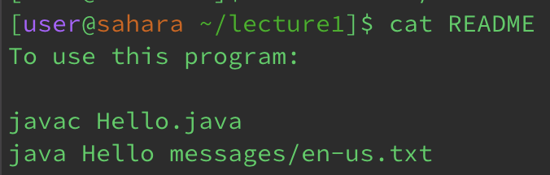

# LAB 1 REPORT 

## This is for the command cd 

**No Arguments** 

1.  
2. The working directory when the command was runned was the `default working directory-home directory`.
3. The reason for why the output was taking you back to the `home directory` when running the command cd(change directory). Is because when there is no arguments the terminal assumes you want to go back to the `default/home working directory`. 
4. The output was not an error.

**Path To Directory** 

1. 
2. The working directory after the command ran was `lecture1`.
3. The reason for why the output was `lecture1` is because cd(change directory) changes your working directory if you are going into a file such as `lecture`.
4. The output was not an error.

**Path To A File** 

1. 
2. The working directory was `lecture1`.
3. The reason for why the output was `bash: cd: README: Not a directory` is because cd cannot be used on files that aren't a directory.
4. The output was not an error as it was the right output to an argument that does no coincide with the use of cd.

## This is for the command ls 

**No Arguments** 

1. 
2. The working directory was `lecture1`.
3. The reason for why the output was the names of files and folders in the `lecture1` folder is because the function of ls is to list files and folders in the working directory.
4. The output was not an error. 

**Path To Directory** 

1. 
2. The working directory was `lecture1`.
3. The reason for why the output was the names of files in the `messages` folder is because ls lists the files and folders in that directory. And the argument `ls messages` prints out the files in that directory. 
4. The output was not an error.

**Path To A File** 

1. 
2. The working directory was `lecture1`.
3. The reason for why the output was a file `README` is because ls just prints out files and folders. Using the argument `ls README` it would just output the file name since `README` doesn't have any files nor folders as it's also not a directory.
4. The output was not an error.

## This is for the command cat 

**No Arguments** 

1.

2. The working directory was the `default/home directory`
3. The output after the command is a blank, but if you type anything in the terminal it would just copy and print the same thing you ran. It seems that if cat has no arguments it automatically will just read the terminal and repeat the argument. 
4. The output was not an error as it seems that the cat function works as intended when there are no arguments, it would just instead by default print any arguments back in the terminal. 

**Path To Directory** 

1.

2. The working directory was `lecture1`. 
3. The output after the command ran was `cat: messages/: Is a directory`. The reason for why this was the output was because, cat can't read directories so it would just print out that the argument was a directory like for this example `cat messages`. 
4. The output was not an error. 

**Path To A File** 

1. 
2. The working directory was `lecture1`.
3. The output after the command ran was the contents that was in the file `README`. This is because the function of cat is to print out the contents of a file/files.
4. The output was not an error.

