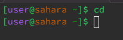

# LAB 1 REPORT 

## This is for the command cd 

**No Arguments** 

1.  
2. The working directory when the command was runned was the default working directory-home directory.
3. The output after the command was ran is that it takes you to the default/home directory, no matter what working directory you're in.
4. The output was not an error.

**Path To Directory** 

1. 
2. 
