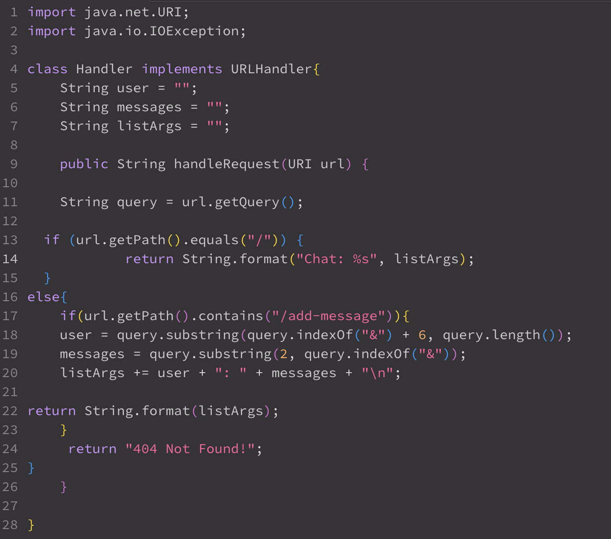
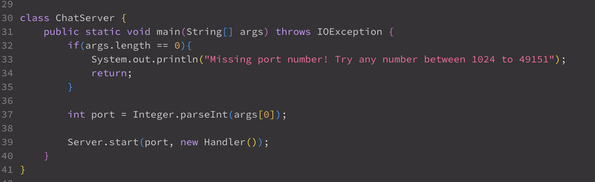
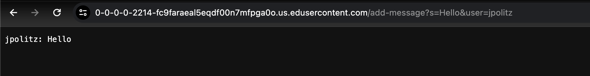
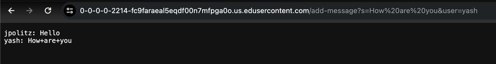
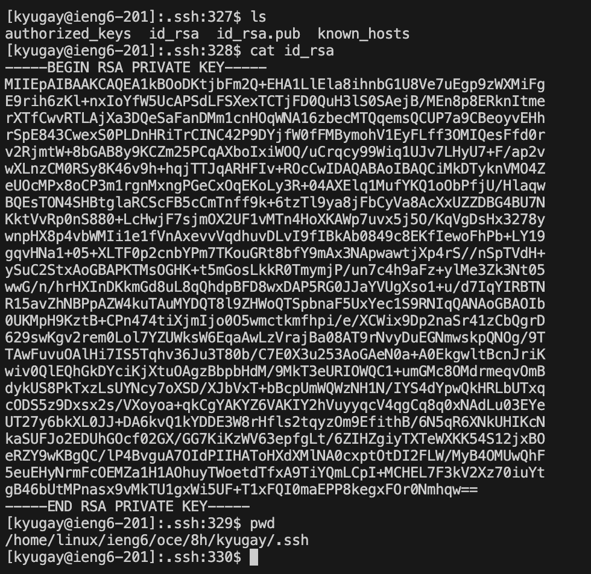
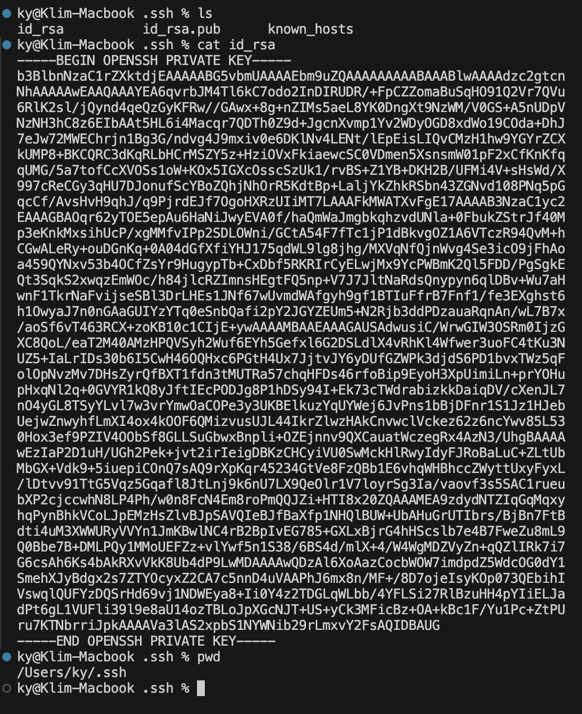
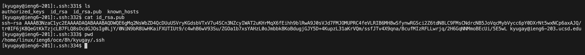
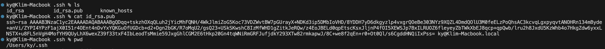
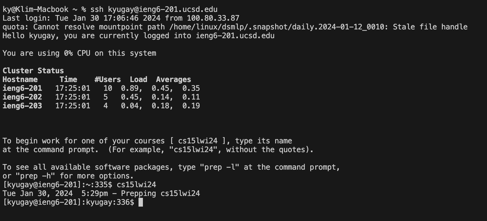

# Lab Report 2 

## Part 1 

 **This is the code** 
 
 

import java.net.URI;
import java.io.IOException;

class Handler implements URLHandler{
    String messages = ""; 
    String listArgs = ""; 
    String user = "";    
    
    public String handleRequest(URI url) {
    
        String query = url.getQuery(); 
  
        if (url.getPath().equals("/")) {
            return String.format(listArgs);
        }else{
            if (url.getPath().contains("/add-message")) {
                if (query == null || query.isEmpty()) {
                    return "400 Bad Request!";
                }
                
                String[] params = query.split("&");
                String message = null;
                String username = null;

                for (String param : params) {
                    String[] keyValue = param.split("=");
                    if (keyValue.length != 2) {
                        return "400 Bad Request!";
                    }
                    String key = keyValue[0];
                    String value = keyValue[1];
                    if (key.equals("s")) {
                        message = value;
                    } else if (key.equals("user")) {
                        username = value;
                    }
                }

                if (message == null || username == null) {
                    return "400 Bad Request!";
                }

                listArgs += username + ": " + message + "\n";

                return listArgs;
            }
            return "404 Not Found!";
            }
    }
}

class ChatServer {
    public static void main(String[] args) throws IOException {
        if(args.length == 0){
            System.out.println("Missing port number! Try any number between 1024 to 49151");
            return;
        }

        int port = Integer.parseInt(args[0]);

        Server.start(port, new Handler());
    }
}

 **These are the screenshots** 
 

1. The method that is called `handleRequest`.
2. The relevant arguments to the method is from the parameter `URI url`. Field `user` stores the second argument of the url(`jpolitz`), field `messages` stores the first argument of the url(`Hello`), the field `list` stores both `user and messages` in the wanted format, and the field `query` stores the whole url(`http://0-0-0-0-2214-fc9faraeal5eqdf00n7mfpga0o.us.edusercontent.com/add-message?s=Hello&user=jpolitz`)
3. Prior to the specific request all the fields were basically empty except `query` since it copies the url. After the specific request all the field's values now hold specific values that was just mentioned at 2.

 

1. The method that is called `handleRequest`.
2. The relevant arguments to the method is from the parameter `URI url`. Field `user` stores the second argument of the url(`yash`), field `messages` stores the first argument of the url(`How Are You`), the field `list` stores both `user and messages` in the wanted format, and the field `query` stores the whole url(`https://0-0-0-0-2214-fc9faraeal5eqdf00n7mfpga0o.us.edusercontent.com/add-message?s=How%20are%20you&user=yash`).
3. Prior to the specific request all the fields were holding the previous values, but after the the specific request. The fields all now have new values that were specified at 2.

## Part 2 
 **This is the location of my private key** 
 

 
Path: `/home/linux/ieng6/oce/8h/kyugay/-ssh/id_rsa` or `/Users/ky/.ssh/id_rsa` 

 **This is the location for my public key**
 

 
Path: `/home/linux/ieng6/oce/8h/kyugay/-ssh/id_rsa.pub` or `/Users/ky/.ssh/id_rsa.pub`

 **This is for logging in without asked a password** 

## Part 3 

What I had learned from lab in week 3 is how to implement my own website without the use of much help, I learned a lot of functionalities on how URL's work, etc. I also got introduced into scp, mkdir, and ssh-keygen which gives you the ability to connect to remote devices without needing to input a password to log in. 

