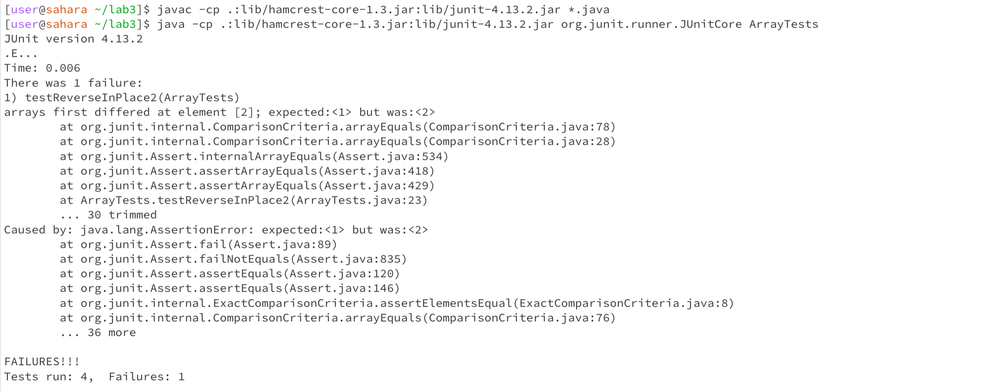

# Lab Report 3 

## Part 1 
I have chosen the reversedInPlace() method and this is the buggy program: 
```
static void reverseInPlace(int[] arr) {
    for(int i = 0; i < arr.length; i += 1) {
      arr[i] = arr[arr.length - i - 1];
    }
}
```
When the test cases are runned the test fails, expecting an output from reversing the array `{3,2,1,0}` but, the program returned `{3,2,2,1}`. This is because the code rewrites the values of the 
original array when trying to find the reverse order of the array. Because of this, the program gets the second half of the array. 

```
@Test 
public void testReverseInPlace2() {
    int[] input1 = { 0, 1, 2, 3 };
    ArrayExamples.reverseInPlace(input1);
    assertArrayEquals(new int[]{ 3, 2, 1, 0 }, input1);
}
```
Even though the program has bugs the test passes, this is because the loop body is executed once and so when the original array is overwritten by a new one the program exits the loop. 
Test with non-failure inducing input: 
```
@Test 
public void testReverseInPlace() {
    int[] input1 = { 3 };
    ArrayExamples.reverseInPlace(input1);
    assertArrayEquals(new int[]{ 3 }, input1);
}
```
JUnit test that fails: 
 
In this example `testReversedInPlace2` fails because the expected was `1` at `input1[2]` but actually it was `2` at `input1[2]`. And so the expected array was `{3,2,1,0}`, but was `{3,2,2,3}`. 

The Bug in the program: 
```
arr[i] = arr[arr.length - i - 1];
```
The code that has the bug: 
```
static void reverseInPlace(int[] arr) {
    for(int i = 0; i < arr.length; i += 1) {
      arr[i] = arr[arr.length - i - 1];
    }
}
```

The fixed version of the code: 
```
  static void reverseInPlace(int[] arr) {
    int[] replaceArray = new int[arr.length];
    for(int i = 0; i < arr.length; i += 1) {
      newArray[i] = arr[arr.length - i - 1];
    }
    for(int i=0; i<arr.length; i++){
      arr[i] = newArray[i];
    }
  }
```
They way to fix this code is to create a new array called `replaceArray` which stores the values of the `arr` array but in reversed order. And the bug in the code is then replaced with 
`replacedArray[i] = arr[arr.length - i - 1]` which then stores the values in the `replacedArray`. Then in the end we basically replace the values of `arr` with the values of `replacedArray`. 
Proof of passing JUnit Tests: 
 

#Part 2 


    
