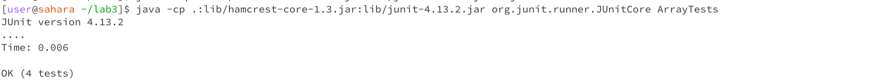
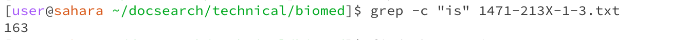
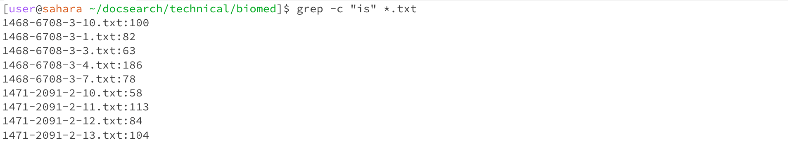
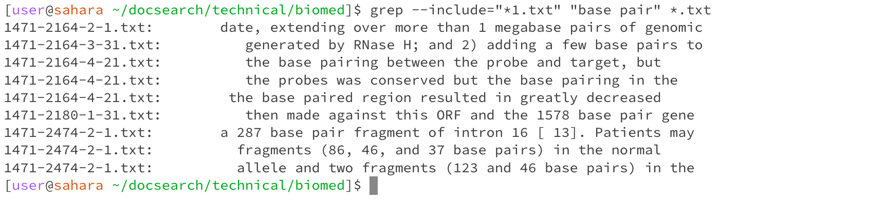
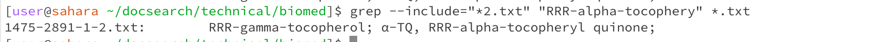
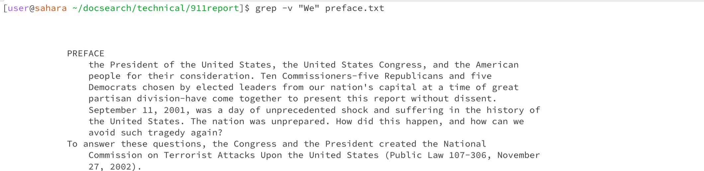
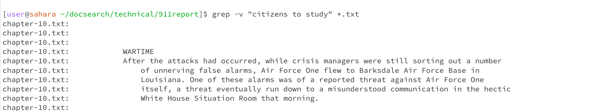
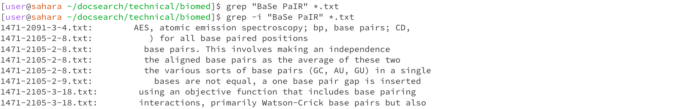

# Lab Report 3 

## Part 1 
I have chosen the reversedInPlace() method and this is the buggy program: 
```
static void reverseInPlace(int[] arr) {
    for(int i = 0; i < arr.length; i += 1) {
      arr[i] = arr[arr.length - i - 1];
    }
}
```
When the test cases are runned the test fails, expecting an output from reversing the array `{3,2,1,0}` but, the program returned `{3,2,2,1}`. This is because the code rewrites the values of the 
original array when trying to find the reverse order of the array. Because of this, the program gets the second half of the array. 

```
@Test 
public void testReverseInPlace2() {
    int[] input1 = { 0, 1, 2, 3 };
    ArrayExamples.reverseInPlace(input1);
    assertArrayEquals(new int[]{ 3, 2, 1, 0 }, input1);
}
```
Even though the program has bugs the test passes, this is because the loop body is executed once and so when the original array is overwritten by a new one the program exits the loop. 
Test with non-failure inducing input: 
```
@Test 
public void testReverseInPlace() {
    int[] input1 = { 3 };
    ArrayExamples.reverseInPlace(input1);
    assertArrayEquals(new int[]{ 3 }, input1);
}
```
JUnit test that fails: 
 
In this example `testReversedInPlace2` fails because the expected was `1` at `input1[2]` but actually it was `2` at `input1[2]`. And so the expected array was `{3,2,1,0}`, but was `{3,2,2,3}`. 

The Bug in the program: 
```
arr[i] = arr[arr.length - i - 1];
```
The code that has the bug: 
```
static void reverseInPlace(int[] arr) {
    for(int i = 0; i < arr.length; i += 1) {
      arr[i] = arr[arr.length - i - 1];
    }
}
```

The fixed version of the code: 
```
  static void reverseInPlace(int[] arr) {
    int[] replaceArray = new int[arr.length];
    for(int i = 0; i < arr.length; i += 1) {
      newArray[i] = arr[arr.length - i - 1];
    }
    for(int i=0; i<arr.length; i++){
      arr[i] = newArray[i];
    }
  }
```
They way to fix this code is to create a new array called `replaceArray` which stores the values of the `arr` array but in reversed order. And the bug in the code is then replaced with 
`replacedArray[i] = arr[arr.length - i - 1]` which then stores the values in the `replacedArray`. Then in the end we basically replace the values of `arr` with the values of `replacedArray`. 
Proof of passing JUnit Tests: 
 

#Part 2 
The grep command is used by writing `-c` or `-count` options. They count the number of occurences of a pattern in a file. Command: `grep -c "phrase/word" files`. 
 

In the image using `-c` counts the number of occurences of the word `is` in the text file `1471-213X-1-3.txt`. The output is `163` which means that word `is` appears `163` times. 

 

Using `-c` option to count the number of occurences of the word "is" in all the text file in the `biomed` directory. I have used `*.txt` to reference  all the files in the text files in the `biomed` directory. The output displays the number of times `is` appears in each text file in the directory. 

The `grep` command can also be used with the `--include`. This option searches through the files which match a pattern specified by the `--include`. The command: `grep --include="file pattern" "phrase" file`.
 

The command above only searches through files which match the pattern` *1.txt` for the phrase "base pair". The `--include option` is followed by the pattern which the resulting file names must follow. The output contains all the text files which end with "1" and have the phrase "base pair". Further, the output prints the lines in which the phrase is present for each file.

 
The command above only searches through files which match the pattern `*2.txt` for the phrase "RRR-alpha-tocophery". There is only one file in the output. This is the only file in the `biomed `directory which ends with the number `2` and contains the phrase "RRR-alpha-tocophery".

The `grep` command can also be used with the `-v` option which works as an invert match. This command prints out all the words in the specified files which do not match the specified phrase/word. The command `grep -v "phrase/word" files`

 
This prints out all the words in the `preface.txt` file which do not match the word `We`. The output from this command is much longer as the file contains more text.

 
> Here the command searches through all the text files in the `911report` and prints out all the content which does not match the phrase "citizens to study". The output clearly shows which file each line corresponds to and the output is much larger than the image above.


The option `-i` with grep ignores the case when searching for phrases/words in files. Generally, grep is case sensitive. The command :` grep -i "phrase/word" files`

 


resources used: [https://www.gnu.org/software/grep/manual/grep.html](url)


    
