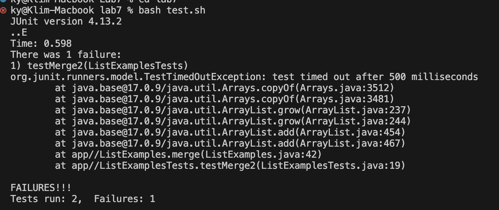

# Lab Report 4 

## This is Step 4 

For this step I just had to log in into the ieng6 account by typing 'ssh kyugay@ieng6-201.ucsd.edu'

## This is Step 5 

 

For this step I had to just git clone

## This is Step 6 

 For this step I just had to bash the test script

## This is Step 7 

