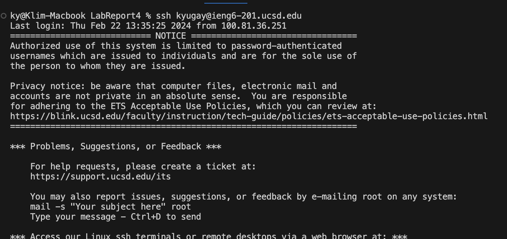
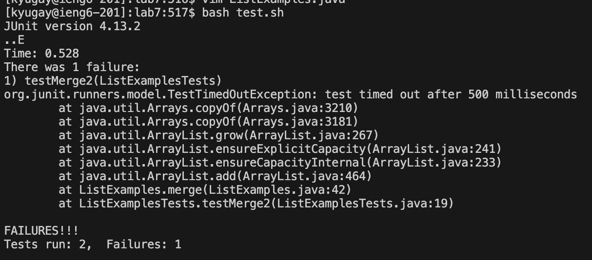
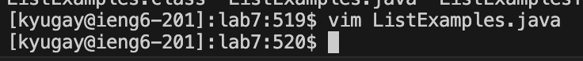
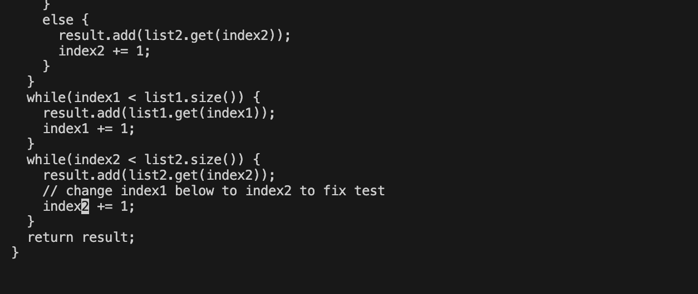
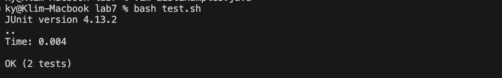
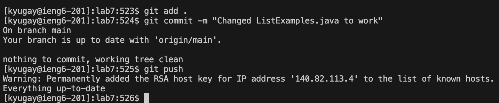

# Lab Report 4 

## This is Step 4 

>For this step I just had to log in into the ieng6 account by typing `ssh kyugay@ieng6-201.ucsd.edu`
> `<up><enter>`

## This is Step 5 

 

>For this step I had to just git clone
>`git<space>clone<space> <ctrl> + <v> "git@github.com:kyugay/lab7.git" <enter>`

## This is Step 6 

>For this step I just had to bash the test script
> `bash<space>test.sh<enter>`

## This is Step 7 

> `vim <space> ListExamples.java` `<enter> e1 x i 2 :wq <enter>`
> vim is what gets you into the code so you can fix the issue, `e1` makes you jump to the last letter of the first word, `x` is what removes the bug, `i` is for insert and I inserted 2 to fix the issue, `:wq` is to save the changes. 

## This is Step 8 

> `bash<space>test.sh<enter>`  The reason for why I did those commands is to see if my fix using vim had worked, and fixed the code so the bash script would pass all the tests. 

## This is Step 9 

> `git <space> add <space> . <enter>`

> `git <space> commit <space> -m <space> "Changed ListExamples.java to work" <space> <enter>`

> `git <space> push <enter>`

