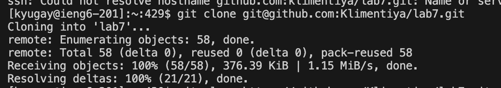

# Lab Report 4 

## This is Step 4 

>For this step I just had to log in into the ieng6 account by typing `ssh kyugay@ieng6-201.ucsd.edu`
> `<up><enter>`

## This is Step 5 

 

>For this step I had to just git clone
>`git<space>clone<space>git@github.com:kyugay/lab7.git<enter>`

## This is Step 6 

>For this step I just had to bash the test script
> `bash<space>test.sh<enter>`

## This is Step 7 

> `vim <space> ListExamples.java` `<enter> e1 x i 2 :wq <enter> `
> Those were exactly my keybinds to make the change

## This is Step 8 

> `bash<space>test.sh<enter>`

## This is Step 9 

> `git<space>commit<enter>`

